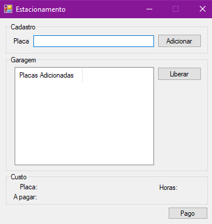

# Sistema para Estacionamento

Desafio de código C# DIO - Sistema simples para gerenciamento de um Estacionamento.

## Usabilidade



- Informe a placa do veículo e clique no botão "Adicionar".
- A lista da tela principal contém todos os veículos estacionados.
- Selecione a placa do veículo e clique em "Liberar" para desocupar vaga e calcular os valores a pagar. 
- Os valores e cálculos serão exibidos no painel "Custo".
- Clique em "Pago" para efetuar o pagamento e permitir a saída do veículo.

## Tecnologias
  - Aplicação Windows
  - Windows Forms
  - C#
  - .NET Framework 4.7.2
  
## Rodando localmente

Instale as dependências

```bash
  https://dotnet.microsoft.com/en-us/download/dotnet-framework/net472
```

Clone o projeto

```bash
  git clone https://github.com/Je0225/Sistema_Estacionamento_CSharp.git
```

Entre no diretório do projeto

```bash
  cd  \EstacionamentoForms\bin\Debug\EstacionamentoForms.exe
```

